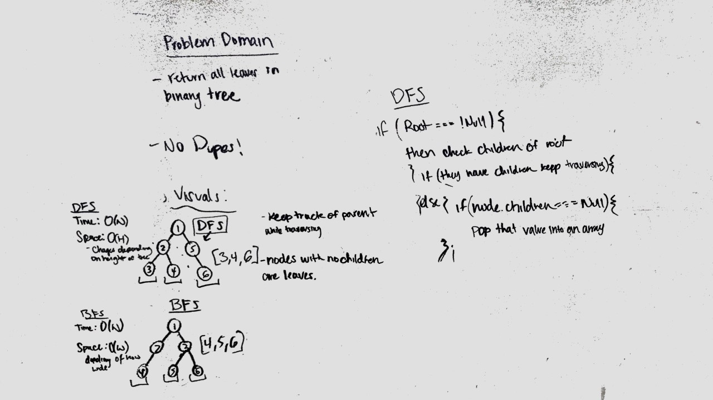

# binary-tree-leaf
find all leaves in a binary tree then add to an array

## Approach

using depthFirst traversal to reach the point where a node.left and node.right eqauls null. then push that value in to an array.

